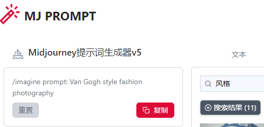
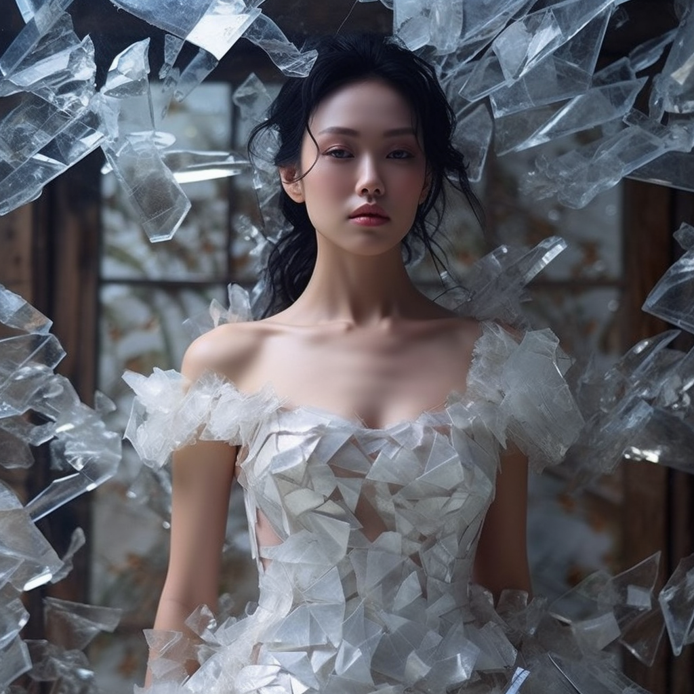
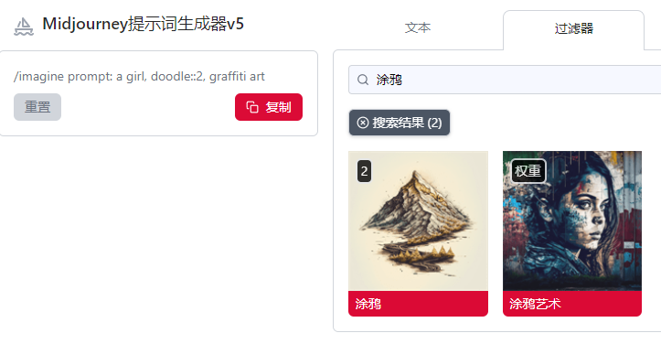
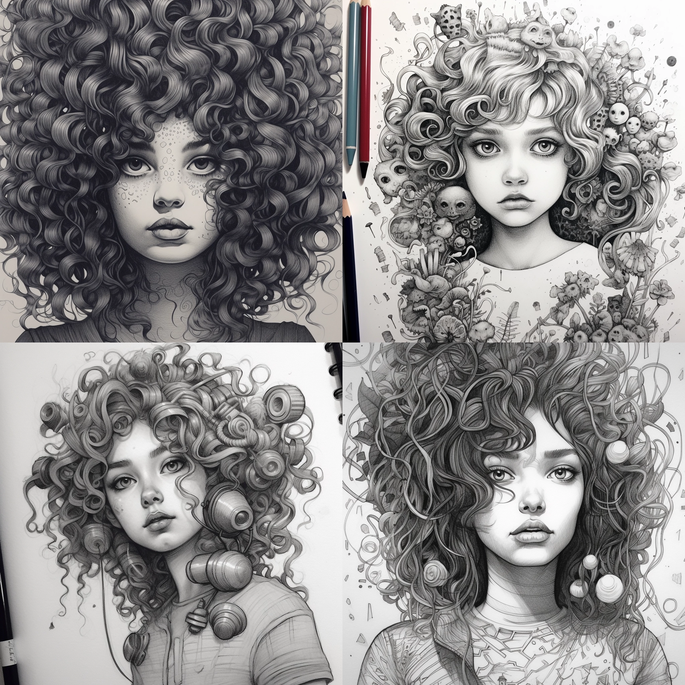
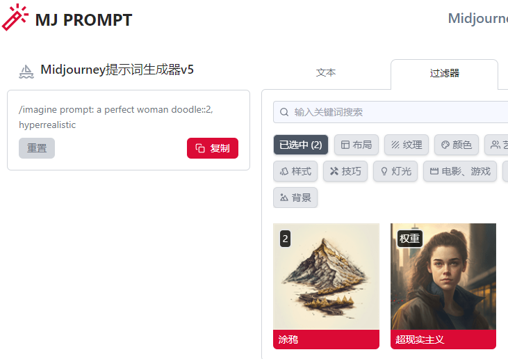
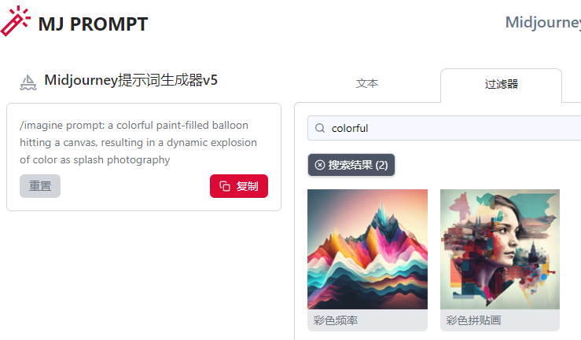
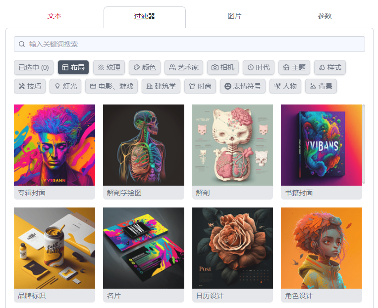
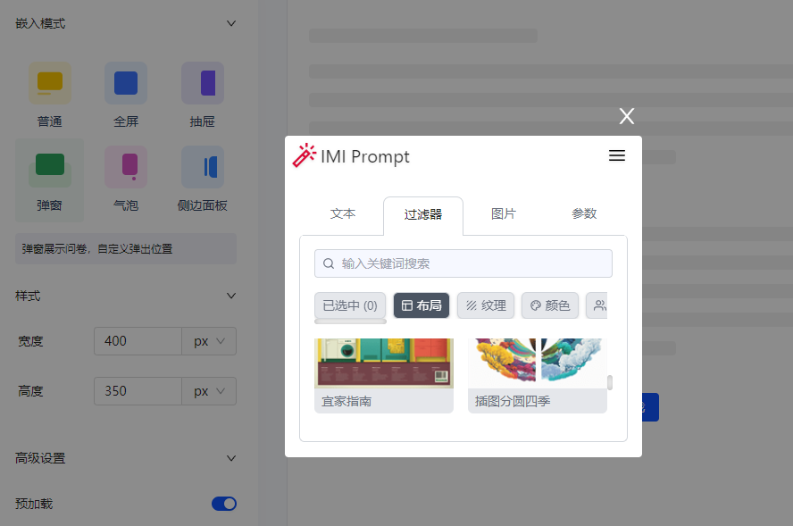
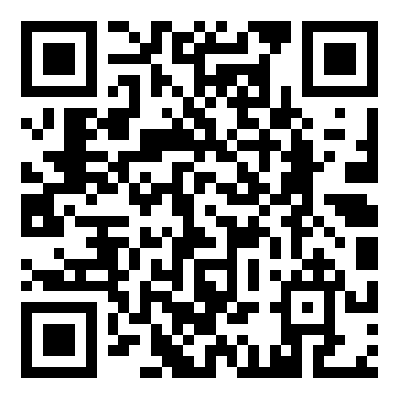

<p align="center"><h1>🧠 Awesome Midjourney Prompts</h1></p>  


Midjourney Prompts提示词助手，提供可视化生成看板，小白一键成MJ作图大师。收录最全的提示词和指令集，目前免费提供使用，支持随意嵌入到你的网站。(更新23-05-10，支持V5.1)

# 项目介绍
* ✅ 支持文本拼接
* ✅ 支持全量过滤词，支持权重，支持搜索
* ✅ 支持在线图片融图拼接
* ✅ 支持自定义参数
* ✅ 支持嵌入任何网站
* ❎ 即将支持中文GPT优化
* ❎ 即将支持在线图床服务
  
# 效果展示 
<div align=center>
 
  <p>按照自己喜欢的风格一键生成</p>
</div>

# 使用教程
> 简单的描述加上可视化关键词，生成图的质量得到了显著的提升。
## Van Gogh style fashion photography（梵高风格的时尚摄影）

<p></p>

## a broken hallelujah
<p></p>  

## a girl doodlle  

<p></p>
<p></p>

##  a perfect woman doodle::2, hyperrealistic
<p></p>
<p></p>

##  a colorful paint-filled balloon hitting a canvas, resulting in a dynamic explosion of color as splash photography --v 5.1 --style raw
<p></p>
<p></p>

# 网站嵌入教程

网站可以无缝嵌入工具，并通过`postMessage`模式接受加工后的`prompts`
```html
 
 <body>
  <div>
    <button class="btn-target">点击打开抽屉</button>
    <div><textarea id="Prompts" placeholder="这里输出指令"></textarea></div>
  </div>
  
</body>
<script>
  IframeShare(
    {
      btnEl: 'btn-target',
      url: "https://punk.openai1s.com/aiimg/prompt?nohead=1&postmsg=1",
      mode: "slider",
      position: 'right',
      width: '650px',
      preload: true,
      defaultOpen: false,
      allowRepeatSubmit: true
    });
  //监听prompt参数
  const prompts = document.getElementById('Prompts')
  window.addEventListener('message', function (event) {
    if (event.origin === 'https://punk.openai1s.com') {
      console.log(event.data, '打印加工后的prompt')
      prompts.innerHTML = event.data
    }
  });
</script>

```
通过参数配置，可以自定义隐藏不需要的内容，更高效地使用Prompt工具。

* 隐藏头部：`nohead=1`
* 隐藏文本框：`notext=1`
* 开启传参：`postmsg=1`

```javascript
//在url后追加参数
url="https://punk.openai1s.com/aiimg/prompt?nohead=1&postmsg=1"
```
嵌入版-推荐
<p></p>
弹窗版

<p></p>

# Midjourney交流群
> 麻烦大佬们备注下来源
<p></p>

# Star History

[](https://star-history.com/#MaleWeb/awesome-midjourney-prompts&Timeline)